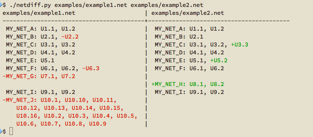

# netdiff
`netdiff` is a PADS netlist comparison tool written in Python

## Example

## Usage
    $ ./netdiff.py --help
    Usage:
        netdiff [-d] <file1> <file2> [--width=<width>]
        netdiff -h | --help
        netdiff --version

    Options:
      -h --help               Show this screen.
      --version               Show version.
      -d                      Show differences only.
      --width=<width>         Column width [default: 40].
